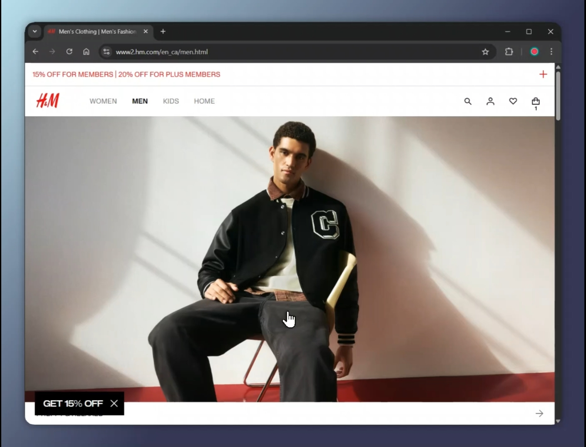

# The Closet Software

## 🚀 Overview

A web extension that enables seamless virtual try-on of clothing items on various e-commerce websites using AI technology. It also comes with saving feature to store and manage your favorite try-on images. All this is achieved seamlessly within your browser and without the need for any login/signup.

## ✨ Features

- Virtual try-on using AI
- Cross-platform web extension (H&M, Amazon, Old Navy, Gap, etc.)
- Save and manage favorite try-on images
- No login/signup required

## 🎥 Demo

[](https://youtu.be/vtxYQ-ta5XI)

- Click to watch a short walkthrough of virtual try‑on.

## 🧠 Tech Stack

- Frontend: Chrome Extension, React
- Backend: Supabase, Deno.js
- Database: PostgreSQL
- APIs / AI Models: Nano banana (Google gemini-image-2.5)
- Deployment: Vercel

## ⚙️ Installation

Step-by-step setup guide:

```bash
git clone https://github.com/moinuddin95/the-closet-software
cd the-closet-software
npm install
npm run build
```

## 📁 Project structure

At a glance

```
the-closet-software/
├─ manifest.json                # Chrome MV3 manifest (content scripts, background, popup, resources)
├─ package.json                 # Dev dependencies and scripts (build, dev)
├─ tsconfig.json                # TypeScript compiler options
├─ vite.config.ts               # Vite bundling config for the extension
├─ README.md                    # Project overview and docs
├─ LICENSE                      # License file
├─ icons/                       # Extension icon assets (16/48/128)
└─ src/
	├─ content.ts               # Content script: detects product pages, injects UI (Save/Try On), DOM logic
	├─ background.ts            # Background service worker: handles runtime messages and backend operations
	├─ popup.html               # Action popup entry HTML (declared in manifest action.default_popup)
	├─ popup.tsx                # React TSX for the popup UI (renders into popup.html)
	├─ popup.css                # Styles used by the popup UI
	├─ styles.css               # Styles injected with the content script (buttons, dropdown, states)
	├─ tryonImageUploadPopup.tsx# In-page upload dialog module injected by the content script
	├─ tryonImageUploadPopup.css# Styles for the in-page upload dialog
	├─ ProductPatterns.json     # Site selector patterns and optional inject templates per retailer
	├─ chromeStorageAdaptor.ts  # Small helper for Chrome storage access
	└─ supabaseConfig.ts        # Supabase client/config used by background flows
```

Notes

- The content script (src/content.ts) communicates with the background service worker via chrome.runtime.sendMessage for actions such as loading product patterns, saving products, uploading images, and processing try-on requests.
- The background service worker (src/background.ts) handles these messages and performs the necessary operations, such as interacting with the Supabase backend or managing Chrome storage.
- The manifest declares src/styles.css as a content stylesheet and registers src/content.js as the content script. The build step produces the JavaScript/CSS artifacts referenced by the manifest.
- The popup UI is defined by src/popup.html (manifest action.default_popup) and rendered by src/popup.tsx.
- The in-page try-on upload UI is dynamically injected by the content script using src/tryonImageUploadPopup.css and src/tryonImageUploadPopup.tsx.
