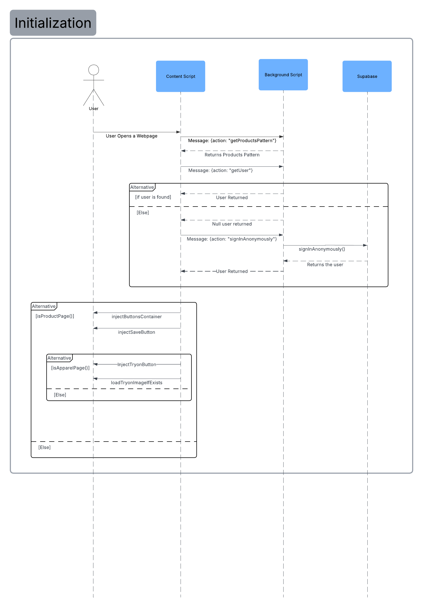
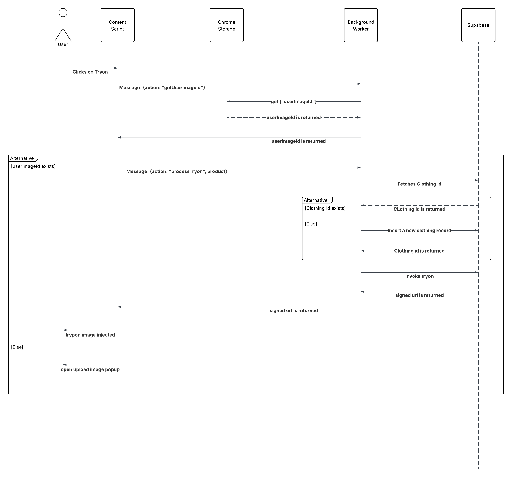

---

## `/docs/architecture.md`

```md
# Architecture

## Components
- Content script (injected into product pages)
- Background service worker (manifest v3)
- Supabase (Auth, Postgres, Storage, Edge Functions)
- User's browser (DOM manipulation)

## Sequence diagrams (text)

### Initial setup




### Try-on flow



## Message contract
(All background <-> content messages, see `/BACKGROUND_WORKER.md` for data schema)
